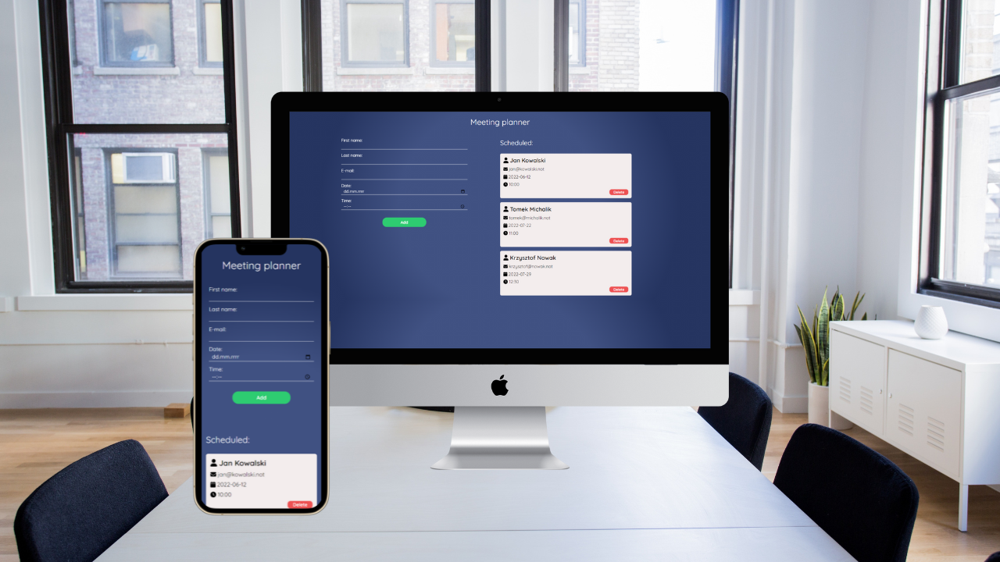

# Meeting Planner App



&nbsp;

### Contents:

- [Overview](#mag-overview)
- [Technologies](#bulb-technologies)
- [Installation](#cd-installation)
- [Contact](#wave-feel-free-to-contact-me)
- [Special thanks](#clap-special-thanks)

&nbsp;

## :mag: Overview

:fire: Click to see live version: [Meeting Planner App](https://kubaparol.github.io/meeting-planner/)!

Meeting Planner App is something like a handy calendar. This app is built in React and uses a local API (JSON server) as a database to manage meetings (with [fake-server](https://github.com/kubaparol/fake-json-server-heroku).)

You can add meetings with validated form and delete selected meetings (using local API).

&nbsp;

## :bulb: Technologies


&nbsp;

## :cd: Installation

### You can run the project locally 

- First you need to clone the project

``` 
git clone
```

- Then install all necessary packages

```
npm i
```
- Start developers mode

```
npm start
```

- App is ready to go:

  -  site
  ```
  http://localhost:3000/
  ```
  - database
  
  ```
  https://fake-database-server.herokuapp.com/meetings
  ```

  &nbsp;

## :wave: Feel free to contact me

You can find me here:

- [LinkedIn](https://www.linkedin.com/in/jakub-parol/)
- [GitHub](https://github.com/kubaparol)

&nbsp;

## :clap: Special thanks

Special thanks to my [Mentor - devmentor.pl](https://devmentor.pl/) - for providing me with this task and for code review.